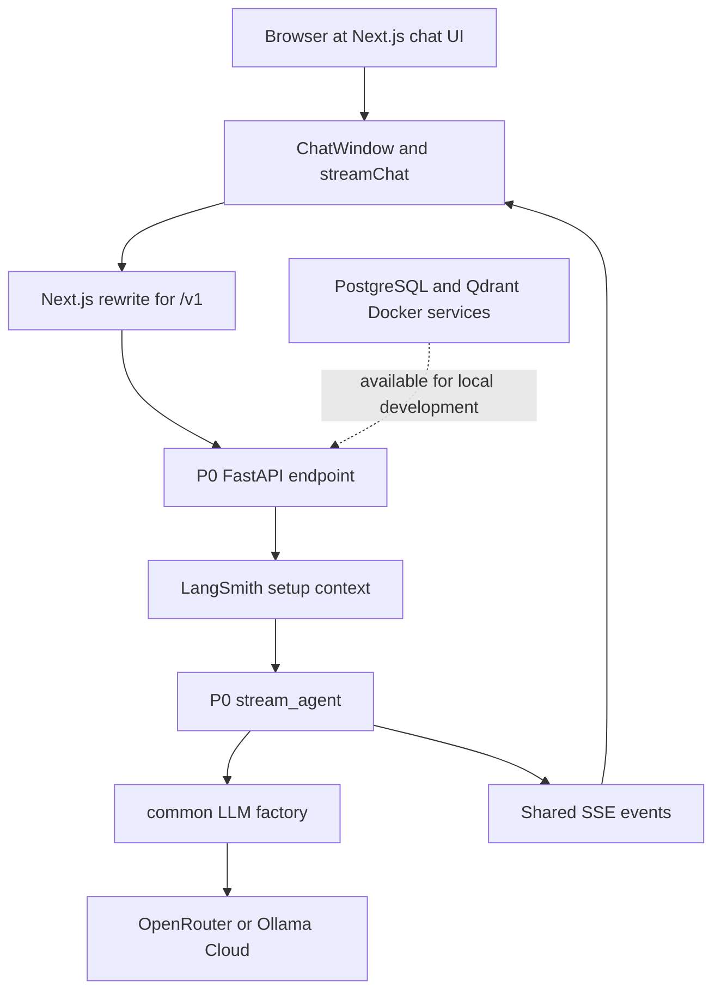

## Status and scope

This repository is organized as one portfolio monorepo, but it is **not yet a suite of ten implemented agents**. The working foundation comprises:

- a Python 3.11–3.12 `uv` workspace containing `common` and agent packages;
- the `common` package for settings, model construction, LangSmith environment setup, and the shared server-sent-event (SSE) wire contract;
- **P0**, a minimal FastAPI/LangChain smoke agent; and
- `apps/chat-ui`, a Next.js 15/React 19 chat shell which can be pointed at a local agent server.

The verified-foundation report records that this stack was exercised locally: the workspace resolved, PostgreSQL and Qdrant became healthy, P0 served an SSE response, the UI rendered streamed tokens and a trace link, and the corresponding LangSmith project contained a trace. Those are verification results for the foundation, not evidence that later portfolio projects exist.

The P1–P10 material below is deliberately labeled **planned**. It is a design curriculum and target architecture; folders, services, libraries, auth, evaluations, and deployments described there must not be assumed to be present merely because they appear in the roadmap.

## Implemented layout and ownership

The root `pyproject.toml` declares a `uv` workspace whose members are `common` and `agents/*`. Python packages target `>=3.11,<3.13`, while root-level pytest discovery includes `common/tests` and each agent's `tests` directory. This creates a useful ownership boundary: reusable Python infrastructure is versioned and tested as `common`; each agent is a separate workspace package that can depend on it through the workspace source mechanism.

`P0-smoke` is currently the sole agent package. It depends on `common`, FastAPI, Uvicorn, Pydantic, `sse-starlette`, and HTTPX. Its distributable Python package is `P0_smoke`—the nonstandard capitalization is explicitly exempted from Ruff's normal package-name rule. The frontend is separate from the Python workspace: `apps/chat-ui` is a private pnpm/Next.js application with its own TypeScript, lint, format, and Vitest scripts.



The implemented P0 request path: the Next.js shell proxies a relative `/v1` request to the selected local FastAPI server, which streams shared SSE events back to the browser. PostgreSQL and Qdrant are local services made available by the foundation; P0 does not itself read or write either service.

### Shared Python contract

`common.config.Settings` is the process configuration owner. It reads the repository-root `.env` file and environment variables (case-insensitively), ignores unknown settings, and is cached by `get_settings()`. It supplies provider credentials, LangSmith settings, and default PostgreSQL/Qdrant connection URLs. A project name is consistently composed as `<LANGSMITH_PROJECT_PREFIX>/<slug>`, defaulting to `LearnAgenticAI/<slug>`.

`common.llm.get_model(project, task, max_tokens=1024)` is the model-construction extension point. The `project` argument labels the caller conceptually but **does not select the model**; `task` selects one of five current routes:

| Task | Current configured model path |
| --- | --- |
| `reasoning` | `deepseek/deepseek-v4-flash-0731` through OpenRouter |
| `tools` | `openai/gpt-4o` through OpenRouter |
| `judge` | `anthropic/claude-opus-4` through OpenRouter |
| `cheap` | `openai/gpt-4o-mini` through OpenRouter |
| `local` | `llama-3.3-70b-versatile` through Ollama Cloud's OpenAI-compatible API |

Unknown task names fall back to `reasoning`. OpenRouter-routed tasks fail early and clearly when `OPENROUTER_API_KEY` is absent; the `local` route similarly requires `OLLAMA_CLOUD_API_KEY`. The factory fixes temperature at zero, sets two retries, and sends an explicit output cap. The cap matters operationally: it was added after an OpenRouter 402 caused by the provider assuming a much larger output budget when `max_tokens` was omitted.

`common.tracing.setup(slug)` is a context manager rather than a permanent process initializer. For the lifetime of a `with` block it sets `LANGSMITH_TRACING`, `LANGSMITH_ENDPOINT`, optional `LANGSMITH_API_KEY`, and the qualified `LANGSMITH_PROJECT`, then restores the previous environment values on exit. Agent invocation that should be traced belongs inside that context.

The backend/UI compatibility boundary is `common.ui_bridge`. It owns a closed set of event names and serializes each as `event: <name>`, `data: <JSON>`, followed by a blank line. The contract supports `token`, `tool_start`, `tool_end`, `message_end`, `error`, and `trace_meta`. New agent backends should emit this contract rather than invent a frontend-specific stream format; the existing UI already knows how to incrementally append tokens, correlate tool start/end by `call_id`, display errors, and attach trace metadata.

## P0 smoke agent: entrypoint, lifecycle, and failure behavior

P0 exists to prove the narrow end-to-end path rather than to implement tools, memory, retrieval, or orchestration. Launch it with:

```bash
cd agents/P0-smoke
uv run uvicorn P0_smoke.server:app --reload --port 8000
```

Its only route is `POST /v1/chat/completions`. The request accepts a non-empty `messages` list with `system`, `user`, or `assistant` roles; FastAPI/Pydantic rejects an empty list or missing list with validation error 422. The handler converts these into LangChain message objects, creates a UUID for the response, and returns `text/event-stream` immediately. The request's `stream` field defaults to `true`, but P0 always uses the streaming response path.

Within the generator, P0 enters `setup("P0-smoke")`, builds the `reasoning` model, prepends its fixed friendly-echo system prompt, and consumes `model.astream(...)`. Every non-empty model chunk becomes a `token` event. Normal completion emits `message_end` with `stop`, followed by `trace_meta` containing the generated UUID and a URL shaped as `https://smith.langchain.com/r/<uuid>`. A failure anywhere in the generator is caught at the API boundary and is returned in-band as an `error` event with code `agent_exception`; it does not change the already-established stream into an HTTP error response.

Two implications matter when evolving P0 into a real agent:

1. The backend sends both the P0 system prompt and any client-supplied system messages. The fixed prompt is first, so projects needing a controlled prompt policy should define how user-supplied system messages are handled rather than relying on this smoke-agent behavior.
2. The trace metadata identifier is locally generated before streaming; it is not obtained from a LangSmith API response in P0. Treat it as UI metadata emitted by the current implementation, not as a verified provider-issued run identifier contract.

## Reusable Next.js shell and local boundary

`apps/chat-ui` renders `ChatWindow` at the home page. On send, the client appends an optimistic user message and an empty assistant message, submits the accumulated conversation with `{ messages, stream: true }`, and updates that assistant message as events arrive. A busy request disables the input; **Stop** aborts the browser fetch without adding an error. Transport or non-abort failures, and backend `error` events, are rendered in the assistant bubble as `[error: ...]` text. Tool calls are retained in a map keyed by `call_id`, rendered in a collapsible JSON view, and trace metadata produces a safe external LangSmith link.

The browser does not call `http://localhost:8000` directly. `streamChat` fetches relative `/v1/chat/completions`; `next.config.ts` rewrites `/v1/:path*` to `NEXT_PUBLIC_AGENT_BASE_URL` or `http://localhost:8000` by default. This is the intentional local service boundary: changing the backend target is a frontend environment/configuration change, while an agent is responsible for maintaining the endpoint and SSE contract. The UI's health route, `GET /api/health`, is only a Next.js shell health check; it says nothing about an agent or model provider's health.

Run the shell separately:

```bash
cd apps/chat-ui
pnpm install
pnpm dev
```

Set `NEXT_PUBLIC_AGENT_BASE_URL` in `apps/chat-ui/.env.local` when the backend is not on the default local port. The configuration is consumed by the Next rewrite, so a changed value requires the Next development server to use the updated environment.

## Local dependencies, configuration, and quality gates

The repository provides Docker Compose definitions for PostgreSQL 16 and Qdrant 1.12. PostgreSQL persists its data through `postgres-data`, exposes configurable host port `POSTGRES_PORT` (default `5432`), and has a `pg_isready` health check. Qdrant persists `qdrant-data` and exposes configurable `QDRANT_PORT` (default `6333`). `bash scripts/dev-up.sh` creates `docker/.env` from its template if necessary, starts both services, then waits up to 30 seconds for PostgreSQL to report healthy and Qdrant's `/healthz` to respond; otherwise it prints Compose status and fails. `bash scripts/dev-down.sh` stops the Compose stack.

The root `.env.example` lists OpenRouter, Anthropic, OpenAI, Ollama Cloud, and LangSmith keys. Although settings expose all of those values, the current factory directly uses only OpenRouter and Ollama Cloud credentials; later provider integrations should not be presumed implemented solely because a placeholder variable exists.

Quality gates match the ownership boundaries:

- Root `scripts/test.sh` runs non-`eval` Python tests and then the chat UI's Vitest suite.
- GitHub Actions syncs all Python packages/extras; runs Ruff, strict mypy, formatting checks, and non-eval pytest for `common` and P0; and separately installs the locked pnpm dependencies, type-checks, lints, and tests the chat UI.
- Unit tests cover settings composition/caching, model routing and missing-key failures, tracing environment restoration, and exact SSE serialization plus payload shapes. P0's live-model tests are marked `eval`, so the normal suite avoids provider calls; server tests still assert malformed-request validation without contacting a model.

## Documented portfolio roadmap — planned, not implemented

The design specifies a progressive ten-project portfolio built on Python agent code, a TypeScript Next.js shell, and shared infrastructure. The stated objective is to make each project a standalone portfolio item while reusing `common`, the chat experience, tracing, and ultimately evaluation infrastructure. The following table is a roadmap, not an inventory of current packages:

| Planned project | Intended focus and main additions |
| --- | --- |
| **P1 — ReAct Research Agent** | Web search/page-reading ReAct agent, tool calling, LangSmith tracing, and a multi-hop-question dataset. |
| **P2 — Production RAG** | PDF ingestion, hybrid retrieval, reranking, citations, Qdrant, and faithfulness/context-precision evaluation. |
| **P3 — Conversational Memory** | LangGraph state, short-term thread memory, PostgreSQL-backed long-term profile memory, and memory-isolation/deletion concerns. |
| **P4 — Multi-Agent Supervisor** | A supervisor coordinating web-researcher, code-analyst, and writer subgraphs with shared notes. |
| **P5 — HITL Approval Workflow** | LangGraph interrupts, resumable/checkpointed destructive actions, a PostgreSQL checkpointer, approvals, and audit design. |
| **P6 — MCP Tool Server** | A custom MCP server and LangGraph adapter integration, with planned filesystem, SQLite, calendar, Gmail, and Slack examples. |
| **P7 — Deep Research Agent** | Planning, parallel subagents, context offload, task delegation, and report synthesis. |
| **P8 — Structured-Output Agent** | Pydantic v2 schemas, validation/retry loops, database writes, and an audit trail. |
| **P9 — Evaluation and Observability Harness** | Reusable LangSmith offline evaluations, custom evaluators, datasets aggregated from earlier projects, and a planned CI regression gate. |
| **P10 — Production Deployment Capstone** | Selection of a prior project for deployment with containerization, auth, rate limiting, monitoring, and production operations. |

The intended order is P1–P3 foundations, P4–P6 orchestration, P7–P8 autonomy/real-system work, then P9–P10 evaluation and shipping. This sequencing encodes dependencies: a supervisor needs capable constituent agents; P9 needs prior agents and their datasets; P10 chooses a proven candidate. The roadmap's proposed infrastructure—additional agent folders, shared evaluators/tools, a P10 public site, Redis, hosted vector storage, OAuth, Sentry, PagerDuty, CI eval gates, Vercel AI SDK, and production auth/rate limiting—is future work unless independently added to source.

### Safe extension path

For a new agent today, create an `agents/<slug>` workspace package that depends on `common`, implement the OpenAI-compatible `POST /v1/chat/completions` surface, wrap model execution in `common.tracing.setup(<slug>)`, and emit `common.ui_bridge` events. Point the existing UI's `NEXT_PUBLIC_AGENT_BASE_URL` to that server. This retains the contracts the foundation actually tests. Add durable state, tools, model/provider routes, and evaluation/deployment features only alongside their own configuration, tests, and operational handling—those capabilities are roadmap targets rather than supplied by P0.
