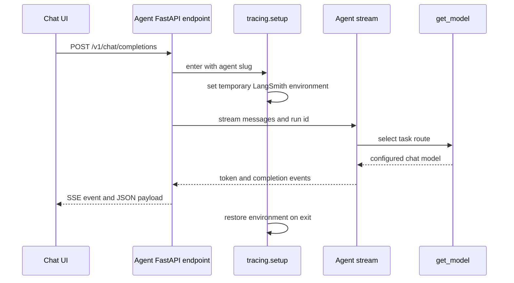
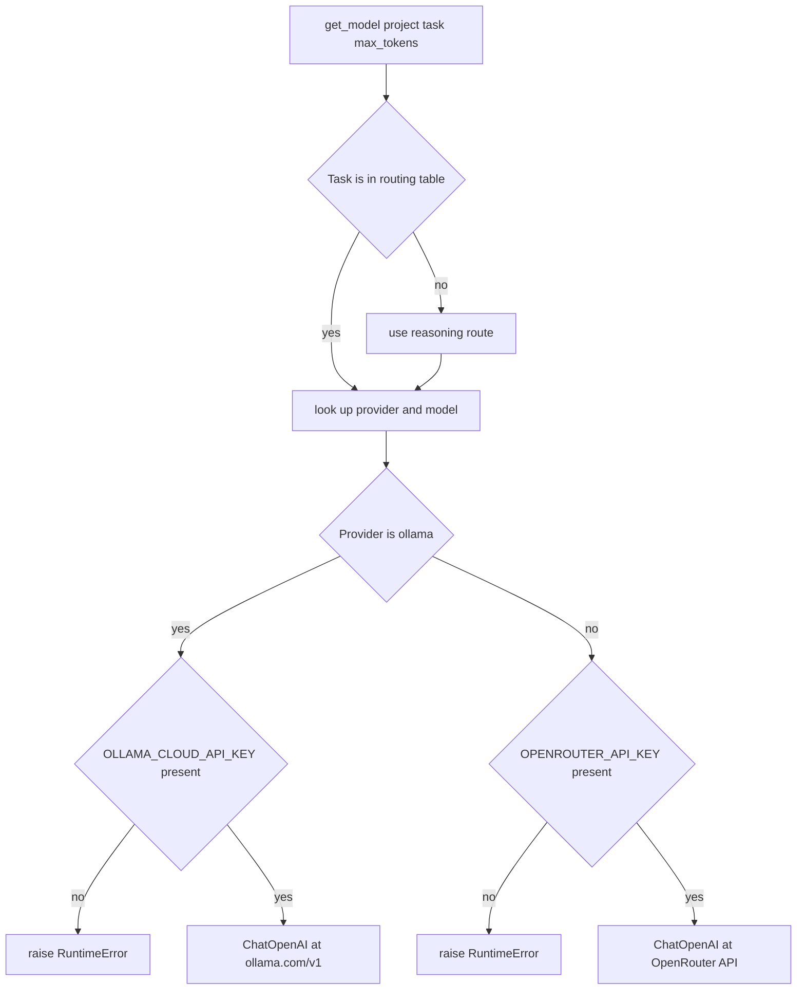

The `common` package is the compatibility layer future agents are expected to preserve. It makes four cross-cutting decisions once: how the process reads configuration, which model a task name selects and how missing credentials fail, how LangSmith state is scoped, and the event language an agent emits to the UI. An agent may have its own graph, tools, prompts, and endpoint implementation; it should not fork these contracts casually.

P0 is the reference consumer. Its FastAPI completion endpoint enters the tracing scope, streams the agent through the shared SSE builders, and converts any exception raised while streaming into an `error` event. The Next.js client, reached through its `/v1/*` rewrite, parses the same closed event set and turns it into progressively rendered assistant text, tool calls, trace metadata, or an inline error.



*Reference request path from the chat UI through an agent's tracing and model contracts to SSE output.*

Configuration feeds model construction and tracing, while `ui_bridge` defines the bytes on the backend-to-UI boundary. P0 also catches failures around the scoped stream and returns a terminal `error` SSE event instead of letting an in-progress response fail without a protocol-level explanation.

## Contract map and safe ownership

| Concern | Public entrypoints | Preservation rule |
| --- | --- | --- |
| Process settings | `Settings`, `get_settings()`, `settings` | Read a typed configuration object; account for the singleton cache when changing the environment in a test or process. |
| Model selection | `get_model(project, task, max_tokens)`, `model_id_for(task)` | Add or change a task route in one routing table, retain the unknown-task fallback, and keep route-specific credential failures actionable. |
| Trace scope | `setup(slug)`, `current_project()` | Put the whole traced operation inside `with setup(slug):`; never leave LangSmith process environment mutations behind. |
| Streaming wire protocol | `to_sse()` and its six event builders | Emit only the six recognized event names and their exact JSON shapes; evolve backend and UI together if the protocol changes. |

`project` in `get_model()` is intentionally not a routing input. The routing key is `task`; the project/slug identifies the agent for trace grouping. Use the same stable slug in `setup(slug)` and model construction for operational clarity, as P0 does with `P0-smoke`.

## Typed settings are cached process state

`Settings` subclasses Pydantic `BaseSettings`. It reads environment variables and a UTF-8 root `.env` file, accepts case-insensitive setting names, and ignores unknown keys. The shared fields cover provider keys, LangSmith values, and default PostgreSQL/Qdrant connection values. Provider keys default to the empty string, so a key is optional at settings-load time but is enforced at the specific route that needs it.

`get_settings()` is an `lru_cache(maxsize=1)` accessor, and the module-level `settings` is initialized from it. Consequently, environment edits after the first `get_settings()` call do not affect consumers that call the accessor until `get_settings.cache_clear()` is called; the already exported `settings` name remains its original object. Treat configuration as process-start state in production. Tests that monkeypatch environment values must clear the cache before exercising a consumer that calls `get_settings()`.

The `project_name(slug)` helper constructs the LangSmith project as `<langsmith_project_prefix>/<slug>`. Defaults make that `LearnAgenticAI/<slug>`; deployment can change the prefix without teaching every agent a different naming convention. The root `.env.example` documents the expected provider and LangSmith variable names, while database/vector-store defaults live in the typed settings rather than in individual agents.

## Task-to-model routing and credential boundary

`get_model()` always returns LangChain `ChatOpenAI`, including provider routes that are accessed through OpenRouter's OpenAI-compatible API. Its task table is deliberately small and closed at the type level, though the function accepts a string for caller resilience:

| Task | Resolved model ID | Transport and required key |
| --- | --- | --- |
| `reasoning` | `deepseek/deepseek-v4-flash-0731` | OpenRouter at `https://openrouter.ai/api/v1`; `OPENROUTER_API_KEY` |
| `tools` | `openai/gpt-4o` | OpenRouter; `OPENROUTER_API_KEY` |
| `local` | `ollama/llama-3.3-70b-versatile` | Ollama Cloud's OpenAI-compatible endpoint `https://ollama.com/v1`; `OLLAMA_CLOUD_API_KEY` |
| `judge` | `anthropic/claude-opus-4` | OpenRouter; `OPENROUTER_API_KEY` |
| `cheap` | `openai/gpt-4o-mini` | OpenRouter; `OPENROUTER_API_KEY` |

An unknown task is normalized to `reasoning` in both `get_model()` and `model_id_for()`. This makes the default deterministic rather than creating a separate unsupported-task failure mode. `model_id_for()` has no credential check and is appropriate for labels or cost reporting; model construction is where credentials are validated.

All configured models use `temperature=0`, `max_retries=2`, and the caller's `max_tokens` (default `1024`). The explicit output cap is a cost and availability guard: it avoids relying on OpenRouter's full model output allowance, which can cause a credit-related request rejection. Do not remove this default without a replacement budget policy.

Credential validation is intentionally early and route-specific. A `local` request without `OLLAMA_CLOUD_API_KEY` raises `RuntimeError` naming that variable. Any other route without `OPENROUTER_API_KEY` raises a corresponding `RuntimeError`. The direct `ANTHROPIC_API_KEY` and `OPENAI_API_KEY` settings exist as typed configuration, but the current factory does not use direct provider clients; non-local tasks require the OpenRouter key.



*Task normalization, credential validation, and client construction in `get_model()`.*

This flow describes configuration-time routing only. It constructs a client; it does not make a model call. Upstream request errors occur later while an agent invokes or streams the returned model and should be surfaced by that agent's endpoint policy.

## LangSmith scope is temporary and nestable

Use tracing around the actual agent invocation or stream:

```python
from common.tracing import setup

with setup("P0-smoke"):
    async for event in stream_agent(messages, run_id):
        yield event
```

On entry, `setup(slug)` resolves the current cached settings, derives the prefixed project name, snapshots four environment variables, and sets `LANGSMITH_TRACING`, `LANGSMITH_ENDPOINT`, and `LANGSMITH_PROJECT`. It sets `LANGSMITH_API_KEY` only when the settings value is nonempty. A `finally` block restores every snapshot value, removing a variable that did not previously exist. This runs on normal completion and exception unwinding, so a nested scope restores its outer scope and a request cannot intentionally leak its selected project into the next one.

Because the mechanism mutates `os.environ`, it is process-global rather than task-local. Agents should keep the scope as narrow as practical and must not assume independent concurrent requests can safely select different environment-backed LangSmith projects. `current_project()` is only an inspection helper returning `LANGSMITH_PROJECT` or `None`; it does not establish tracing or validate credentials.

The settings lookup happens when `setup()` is entered rather than when `tracing` is imported. This permits a test or controlled runtime setup to call `get_settings.cache_clear()` before opening the scope and obtain changed configuration, without changing the context-manager interface.

## SSE is a closed backend-to-UI protocol

Each backend event is one UTF-8 byte sequence in standard SSE framing:

```text
event: <event_type>
data: <compact JSON object>

```

`to_sse(event_type, data)` validates the event name before serializing the JSON with compact separators and `ensure_ascii=False`. It raises `ValueError` for an unknown name rather than putting an unparseable protocol extension on the wire. `data` must still be JSON-serializable; serialization failures propagate to the caller, which P0's server catches and converts to `error` when they occur inside the event source.

The vocabulary and payload shapes are closed as follows:

| Event | Payload shape | UI meaning |
| --- | --- | --- |
| `token` | `{ "content": string }` | Append content to the in-progress assistant message. |
| `tool_start` | `{ "tool_name": string, "args": object, "call_id": string }` | Create/replace a pending tool call keyed by `call_id`. |
| `tool_end` | `{ "call_id": string, "result": any }` | Attach the result only if that call is already known. |
| `message_end` | `{ "finish_reason": string }` | Delimits normal assistant completion; its builder defaults reason to `stop`. |
| `error` | `{ "message": string, "code": string }` | Append an inline error message; the builder default code is `agent_error`. |
| `trace_meta` | `{ "run_url": string, "run_id": string }` | Attach a LangSmith trace link to the assistant message. |

P0 demonstrates normal ordering: zero or more `token` events, then `message_end` with `stop`, then `trace_meta`. Tool-capable agents should emit `tool_start` before the matching `tool_end` so the UI can correlate by `call_id`. P0 catches stream failures and emits `error` with code `agent_exception`; its response remains `text/event-stream`.

The browser client uses `fetch`, incrementally splits lines, records an `event:` name, parses the following `data:` JSON, and yields a typed event only when the event name is in its own matching six-name guard. It silently skips malformed JSON and unknown names. Therefore merely adding a Python event builder does not add a UI feature: update the TypeScript union, parser guard, reducer/rendering behavior, and contract tests in the same compatibility change. Conversely, do not rename a payload key or event name while existing agent backends or the UI expect the current form.

The chat UI sends `POST /v1/chat/completions` with `{ messages, stream: true }`; Next.js rewrites `/v1/*` to `NEXT_PUBLIC_AGENT_BASE_URL` (default `http://localhost:8000`). The P0 endpoint accepts nonempty system/user/assistant messages, maps them to LangChain messages, creates a per-request UUID run ID, and returns `StreamingResponse(..., media_type="text/event-stream")`. This is the concrete integration boundary shared helpers are designed to support.

## Verification that protects the contracts

The focused common tests are deliberately offline: settings tests prove defaults, environment override behavior, project composition, and cache identity; model tests assert every task resolution, both endpoint configurations, and both missing-key failures; tracing tests assert project selection, prefix override, and restoration; SSE tests assert exact framing, closed-type rejection, and each helper payload. Keep such contract tests deterministic and avoid live provider calls.

P0 adds two integration layers. Server tests verify malformed completion requests are rejected with HTTP 422 before streaming; the live endpoint test is marked `eval` because consuming its first response requires a real provider call. Agent streaming and invocation tests are likewise `eval`-marked. The repository defines `eval` for tests that call LLM APIs, allowing ordinary verification to exclude provider-dependent tests:

```bash
uv run pytest -m "not eval"
```

For a controlled end-to-end check, configure `OPENROUTER_API_KEY` (and optionally LangSmith values) in the root `.env`, run the P0 FastAPI server, then use the chat UI. Validate that the stream uses `text/event-stream`, text arrives as `token` events, a trace link receives the run ID/URL after completion, and an induced upstream failure appears through the `error` event rather than as a silent broken stream.

## Change checklist for future agents

1. Use `get_settings()` at consumption points; clear its cache only in test/bootstrap scenarios that intentionally change environment input.
2. Choose a named task for every `get_model()` call and provide a deliberate `max_tokens` budget when the default is unsuitable. Treat a new task name as a shared routing-policy change.
3. Wrap the endpoint's complete invocation or async stream in `with setup(<stable-agent-slug>):` and let the context manager restore global environment state.
4. Yield bytes from `token_event`, tool-event builders, `message_end_event`, `trace_meta_event`, or `error_event`; do not hand-format incompatible SSE.
5. When changing the wire vocabulary or payload, change `common.ui_bridge`, `apps/chat-ui/lib/types.ts`, `apps/chat-ui/lib/api.ts`, UI handling, and both Python/TypeScript tests together. Preserve compatibility or version the boundary.
6. Keep credential values out of logs, responses, traces, and test fixtures. Fail at client construction with the existing actionable variable names rather than deferring a predictable misconfiguration to a remote request.
