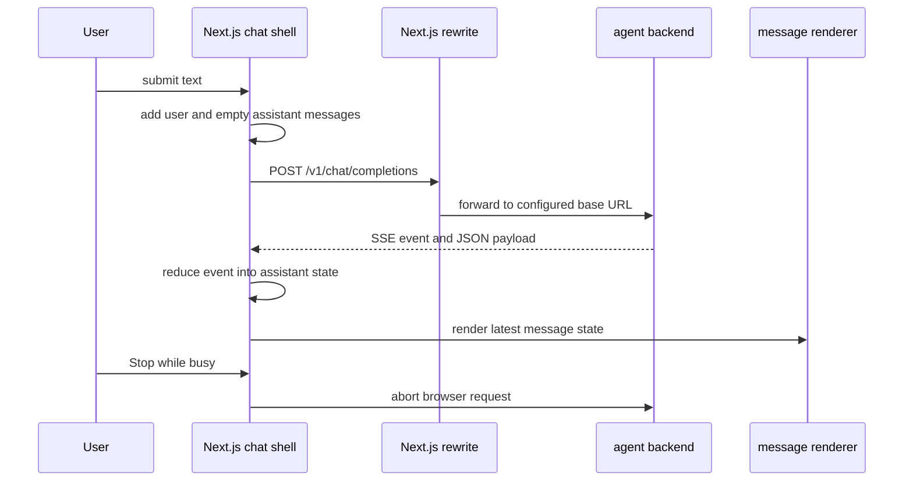

The reusable shell in `apps/chat-ui` is deliberately a thin client for an agent service, not an agent runtime. Its stable boundary is a relative `POST /v1/chat/completions` request and a small, closed Server-Sent Events (SSE) vocabulary. The P0 smoke agent is the reference implementation, but another backend can replace it without changing the shell if it preserves the request shape, HTTP/SSE behavior, and event payload semantics described here.

The browser never chooses a backend URL itself: it posts to the same-origin relative route and Next.js proxies all `/v1/*` paths. This keeps the frontend code independent of the local FastAPI origin while making the configured service responsible for the agent API.



*One interactive turn: optimistic local state, proxied completion request, incremental SSE reduction, and browser-side cancellation.*

## Boundary ownership and entrypoints

| Concern | Owner | Compatibility requirement |
| --- | --- | --- |
| Chat page and interaction state | `ChatWindow` rendered by `app/page.tsx` | The shell owns the visible turn history and one in-flight request; the backend does not receive UI-only tool or trace objects. |
| Backend selection | `NEXT_PUBLIC_AGENT_BASE_URL` and `next.config.ts` | Preserve the `/v1/:path*` proxy path, or change both the UI request and deployment/proxy configuration together. |
| Request transport and parsing | `lib/api.ts` `streamChat()` | Receive a successful streamed response carrying the expected SSE line format and one of the six event names. |
| Wire schema | `lib/types.ts` and `common.ui_bridge` | Preserve the exact event names and required JSON fields; the Python helper is the reference serializer. |
| Presentation | `MessageBubble`, `ToolCallTree`, and `TraceLink` | Emit events in an order the reducer can correlate: especially `tool_start` before the matching `tool_end`. |

`GET /api/health` belongs to the Next.js application and only returns `{ "status": "ok" }`; it does **not** probe the selected agent backend or its model provider. Use it to check that the shell is running, not to establish end-to-end agent availability.

## Proxy configuration and operation

The rewrite maps the browser-visible `/v1/:path*` to:

```text
${NEXT_PUBLIC_AGENT_BASE_URL}/v1/:path*
```

When the variable is absent, the destination is `http://localhost:8000/v1/:path*`. The supplied `apps/chat-ui/.env.example` sets the same local base URL. For a different backend, put its origin in `apps/chat-ui/.env.local`, for example:

```text
NEXT_PUBLIC_AGENT_BASE_URL=http://localhost:8000
```

Then start the UI separately from the backend:

```bash
cd apps/chat-ui
pnpm install
pnpm dev
```

The reference local backend is launched independently on port 8000:

```bash
cd agents/P0-smoke
uv run uvicorn P0_smoke.server:app --reload --port 8000
```

Because the rewrite reads the environment when Next configures the application, restart the Next development server after changing the target. A deployment replacing P0 should expose the same path behind the configured origin; the current shell has no per-request backend selector, authentication header injection, retry policy, or direct cross-origin fetch path.

## Completion request contract

`streamChat()` sends exactly one JSON request per submitted turn:

```http
POST /v1/chat/completions
content-type: application/json

{"messages":[...],"stream":true}
```

Each transmitted history item is `{ role, content }`, where the TypeScript call signature permits only `"user" | "assistant" | "system"` roles and `content` is a string. The reference FastAPI endpoint accepts the same three role values, requires a nonempty `messages` array, and rejects absent or empty `messages` with HTTP 422. Its `stream` field defaults to `true`, and its implementation always returns a streaming response.

At send time, `ChatWindow` trims input and refuses blank input or a second request while `busy`. It optimistically appends a user message followed by an empty assistant message, then uses the history ending at that user message as the request body. The UI's generated message IDs, tool calls, and trace metadata are local presentation state and are not submitted. Although `Message` has `system` and `tool` roles in its broader display type, the live UI only creates user and assistant history; the comment explicitly reserves the `tool` role for messages that never enter conversation history.

This creates several substitution invariants:

* Accept ordered prior user/assistant exchanges and, for a compatible generic client, system messages. Do not require a UI-created conversation ID, tool-result message, or request metadata that the shell does not send.
* Return a successful response with a readable body for a stream. If `fetch` receives a non-OK response, or an OK response without a body, the adapter yields one `{ type: "error", message: "HTTP <status>", code: "http_error" }` event and stops.
* Treat the client request as a single turn over the full in-memory history. The current shell does not persist or reload conversations, and it does not append a completed tool result to the next request.

## SSE wire contract and parser assumptions

The shared Python serializer frames each event as UTF-8 bytes in the following exact two-line form, followed by a blank line:

```text
event: <event_type>
data: <compact JSON object>

```

`common.ui_bridge.to_sse()` validates the event name against its closed set before JSON serialization. Its helpers are the safest way for a Python backend to produce compatible bytes. The TypeScript `StreamEvent` union and its runtime `VALID_EVENT_TYPES` guard recognize the same six names:

| Event | Required JSON data | Shell reduction and visible result |
| --- | --- | --- |
| `token` | `{ "content": string }` | Appends `content` to the active assistant bubble. |
| `tool_start` | `{ "tool_name": string, "args": object, "call_id": string }` | Adds or replaces a tool record keyed by `call_id`. |
| `tool_end` | `{ "call_id": string, "result": any }` | Adds `result` to an already-known matching tool record. |
| `message_end` | `{ "finish_reason": string }` | Marks normal completion at the protocol level; the present reducer does not otherwise alter visible state. |
| `error` | `{ "message": string, "code": string }` | Appends `[error: <message>]` to the active assistant text. |
| `trace_meta` | `{ "run_url": string, "run_id": string }` | Attaches the trace link metadata to the active assistant message. |

The parser is intentionally minimal rather than a general SSE implementation. It decodes chunks incrementally with `TextDecoder`, retains an incomplete trailing line in a buffer, and processes only newline-terminated lines. `event: ` records the trimmed current event name; the next `data: ` line is parsed as a complete JSON value and yielded only if that recorded event name is in the six-name guard. A blank line clears pending event state. Unknown event names and malformed JSON are silently skipped, and the parser does no runtime validation of payload fields before casting the parsed object to `StreamEvent`.

A compatible backend must therefore send a separate `event: ` line before each `data: ` line, use the exact prefixes and newline framing, and put a complete single JSON object on that data line. Do not rely on unsupported SSE features such as multiline data payloads, comments, event IDs, or a final unterminated event being consumed. Invalid payload field types may reach the UI unchecked and break or degrade rendering; compatibility means matching both event name **and** table payload shape.

The P0 reference response is `StreamingResponse(..., media_type="text/event-stream")`. It normally emits zero or more `token` events, then `message_end` with `finish_reason: "stop"`, then `trace_meta`. A tool-capable replacement may interleave tokens and tool lifecycle events, but must issue `tool_start` before the correlated `tool_end`; an end event with no existing map entry is ignored. `call_id` is the correlation key, so it must be stable and unique for concurrently or repeatedly invoked calls in one assistant message.

## State lifecycle, cancellation, and failures

The UI holds `messages`, draft `input`, a `busy` flag, and the active `AbortController` in client-side React state/refs. It builds one mutable accumulated assistant message and a `Map<string, ToolCall>` during a stream, then replaces the final item in `messages` after every event to force progressive rendering. Updates preserve tool insertion order through `Array.from(toolCalls.values())`. The message scroller moves to the bottom whenever the message array changes.

While streaming, input is disabled and **Stop** calls `AbortController.abort()`. An abort exception is deliberately silent: it retains whatever tokens and tool state have already rendered and adds no error text. Any other thrown transport/iteration exception is formatted into the active assistant message as `[error: <message>]`. Backend `error` events take the same visible inline-error route but do not themselves throw. The `finally` block clears `busy` and the controller in all paths, allowing the next turn.

The reference P0 server demonstrates the backend half of the failure boundary: validation happens before streaming; once the generator is active it wraps tracing and agent iteration in a broad exception handler and emits `error_event(str(e), code="agent_exception")`. A future backend should similarly distinguish pre-stream request rejection from failures after an SSE response begins. It cannot turn an established stream into a normal HTTP error response, so an in-band `error` event is the interoperable way to explain a stream failure.

## What users see

`MessageBubble` labels every message with its role and renders content as plain React text with `whiteSpace: "pre-wrap"` and word breaking. User messages align right; other roles align left. The shell does not parse Markdown, execute HTML, or render rich citations in message content.

Tool calls appear beneath the assistant content as independently collapsible `ToolCallTree` records. A closed record shows the tool name and the first eight characters of `call_id`; opening it renders pretty-printed JSON arguments and, once present, the JSON result. This is diagnostic presentation, not a confirmation or approval mechanism. Tool arguments and results may be visible to anyone using the chat page, so backends should not emit credentials or other sensitive values in these fields.

A `trace_meta` event produces `TraceLink`, labeled “View trace in LangSmith” with a shortened run ID. It opens `run_url` in a new tab and uses `rel="noopener noreferrer"`. The shell does not independently verify that the URL is a LangSmith URL, so the backend owns the correctness and safety of that metadata.

## Replacing P0 with a future backend

Implement the following minimal adapter surface rather than coupling an agent graph or provider SDK to React components:

1. Serve `POST /v1/chat/completions` at the origin selected by `NEXT_PUBLIC_AGENT_BASE_URL`.
2. Validate and translate nonempty `{ messages, stream: true }` requests with `system`, `user`, and `assistant` role strings into the backend's native message format.
3. Return `text/event-stream` and serialize only the six supported events using `common.ui_bridge` where possible.
4. Stream text through `token`; pair every tool result with a prior `tool_start` carrying the same `call_id`; send `message_end` on normal completion; and optionally send `trace_meta` when a trace URL and ID are available.
5. On an error after streaming starts, emit a structured `error` event with a useful message and code. Do not substitute a new event name, unframed JSON, or an HTML error page.
6. Preserve the client-visible field names. Additive protocol changes require coordinated updates to `common/src/common/ui_bridge.py`, `apps/chat-ui/lib/types.ts`, `apps/chat-ui/lib/api.ts`, the `ChatWindow` reducer, and relevant presentation/tests. For a breaking change, version the endpoint or deploy compatible backend and UI changes together.

P0 is intentionally a smoke implementation: it converts request messages to LangChain messages, allocates a UUID run ID, enters `setup("P0-smoke")`, streams a model, and uses shared event builders. It is useful as a concrete compatibility test, not as a requirement to use LangChain, FastAPI, or LangSmith. Any implementation language/framework is suitable if the HTTP and SSE contract remains observable-equivalent to the shell.

## Focused verification

The current UI Vitest suite only exercises `GET /api/health`; it does not test the stream parser, reducer, cancellation, tool rendering, or trace rendering. The shared Python tests are stronger protocol guardrails: they assert exact framing, reject unknown event types, and check every helper payload. P0 server tests verify empty or missing messages receive 422 without a live model call; its well-formed streaming test and agent stream tests are marked `eval` because they require provider access.

When replacing a backend, add deterministic boundary tests in addition to agent-specific tests:

- unit-test the adapter against fragmented byte chunks, unknown event names, malformed JSON, and the exact six valid event names;
- verify a normal stream renders accumulated tokens, `message_end`, and optional trace metadata;
- verify `tool_start` followed by `tool_end` shows arguments and result, and document behavior for an unmatched end;
- verify backend non-2xx responses become the shell's `http_error` event and that an in-stream backend failure becomes an inline error;
- manually verify **Stop** aborts a long-running response without rendering an abort error; and
- run the shell's available checks with `pnpm typecheck` and `pnpm test`, plus the shared SSE tests for changes to `common.ui_bridge`.

For the broader contract context, see [Shared Agent Contracts](/openwiki/concepts/shared-agent-contracts.md), the P0 smoke-agent documentation, the completion-stream workflow, and the repository verification strategy.
