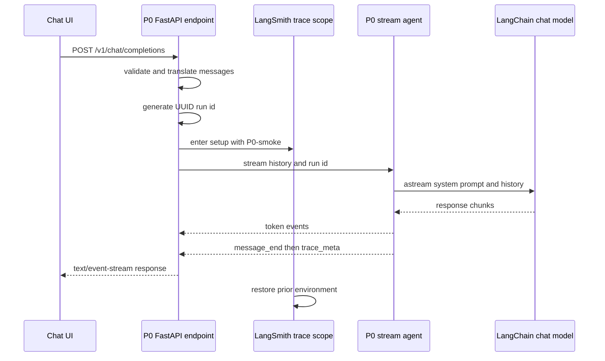

The P0 smoke agent is the deliberately small reference backend for the chat UI contract. It does not own conversations, persistence, tools, authentication, or a public non-streaming completion API. Its responsibility is narrower: accept an ordered chat history, invoke the configured LangChain model with a fixed friendly-echo instruction, and return the assistant turn over Server-Sent Events (SSE). This makes it a useful integration baseline before more complex agents introduce graphs, tool loops, or storage.

The service exposes one endpoint, `POST /v1/chat/completions`. The local Next.js shell posts to that relative path and proxies `/v1/*` to the configured agent origin; P0 is normally run on port 8000. The backend's use of the shared model, tracing, and SSE helpers is intentional: it demonstrates the compatibility boundary described by [Shared Agent Contracts](/openwiki/concepts/shared-agent-contracts.md) and [Chat UI and Agent API Boundary](/openwiki/integrations/chat-ui-agent-boundary.md).

## Request boundary and message translation

`ChatCompletionRequest` requires a nonempty `messages` list and accepts `stream`, which defaults to `true`. Each message has a `content` string and exactly one of three roles: `system`, `user`, or `assistant`. FastAPI/Pydantic rejects a missing or empty `messages` field before the endpoint starts streaming, producing its normal HTTP 422 validation response.

The endpoint maps the accepted transport roles directly to `SystemMessage`, `HumanMessage`, and `AIMessage` respectively, preserving their supplied order and content. The conversion supports prior assistant turns as history as well as user and system turns. It is a protocol adapter only: P0 does not add a conversation identifier, store the history, or validate any semantic relationship between adjacent messages.

Although the request contains `stream`, the implementation always returns a `StreamingResponse` with media type `text/event-stream`; the flag does not select a non-streaming HTTP mode. A client replacing or reusing this endpoint should therefore treat the stream as the observable API, rather than assuming that `stream: false` calls `invoke()`.

## Completion flow



*Normal P0 request lifecycle, from the UI request through scoped tracing and streamed SSE output.*

For every valid request, the server generates a UUID string before creating the event generator. While the generator is consumed, it enters `setup("P0-smoke")`, which scopes LangSmith's environment-backed project configuration to the operation and restores the previous values when the scope exits. With default settings the project name is `LearnAgenticAI/P0-smoke`; the `LANGSMITH_PROJECT_PREFIX` setting can change the prefix. The trace scope covers model construction and iteration rather than only the initial HTTP handler.

`stream_agent()` constructs the model through `get_model("P0-smoke", task="reasoning")`. The shared `reasoning` route uses the OpenRouter-compatible `ChatOpenAI` configuration for `deepseek/deepseek-v4-flash-0731`, requires `OPENROUTER_API_KEY`, has `temperature=0`, a 1024-token default cap, and allows two retries. Consequently, a missing required provider credential or an upstream model error can occur only as the stream begins or progresses, after a streaming response has been selected.

Before the caller's converted history, P0 prepends its own `SYSTEM_PROMPT`: a brief, warm acknowledgement instruction that asks concise one- or two-sentence answers for questions. Caller-supplied system messages remain in the history after this fixed instruction; they do not replace it. The model is streamed with `astream()`. For each chunk whose `content` attribute is nonempty, P0 emits a shared `token` event containing that content. Empty-content chunks produce no token event.

## SSE completion and trace metadata

P0 uses the shared `common.ui_bridge` serializers, not hand-formatted response text. In the normal case its event order is:

1. zero or more `token` events, each with `{ "content": string }`;
2. `message_end` with `{ "finish_reason": "stop" }`; and
3. `trace_meta` with the generated run ID and `https://smith.langchain.com/r/<run_id>`.

The shared serializer frames each event as UTF-8 bytes using an `event:` line, one compact JSON `data:` line, and a terminating blank line. It supports a closed six-event vocabulary shared with the UI: `token`, `tool_start`, `tool_end`, `message_end`, `error`, and `trace_meta`. P0 itself emits no tool events. The UI appends token content to its active assistant message and attaches trace metadata to that message, so the normal ordering places the LangSmith link after visible completion.

The UUID and trace URL are generated by P0; they are not returned by LangChain or verified against a trace service. In other words, `trace_meta` gives the UI a deterministic LangSmith run-link shape for this request, while actual trace recording depends on the shared tracing configuration and available LangSmith credentials.

## Failure behavior and lifecycle limits

There are two distinct failure boundaries:

- **Before a response stream exists:** schema failures, such as absent or empty `messages`, are HTTP 422 validation failures.
- **During the event generator:** the server catches any exception raised while entering the tracing scope or consuming `stream_agent()` and yields an in-band `error` event with `code: "agent_exception"` and `message: str(exception)`.

Once an SSE response starts, P0 cannot replace it with a conventional JSON or HTTP error response. The in-band `error` event is therefore the interoperable failure signal for model configuration failures, tracing setup failures, and stream-time provider failures. It does not guarantee a normal terminal sequence: if an exception happens before `stream_agent()` yields `message_end` and `trace_meta`, the error event is emitted instead and no compensating completion or trace event is added.

The trace context manager restores its affected environment variables in `finally`, including on exception unwinding. However, its mechanism changes process environment variables and is therefore process-global, not request-local. P0 keeps the scope limited to generation, but concurrent requests should not be assumed to have independently isolated environment-backed LangSmith project selection.

The service also has no cancellation-specific backend policy. The browser can abort its fetch, but the endpoint contains no explicit disconnect check or cleanup beyond normal async-generator/context-manager unwinding. Do not infer durable run cancellation, conversation persistence, retries beyond the model factory configuration, or endpoint authentication from this smoke implementation.

## The intentional non-streaming helper distinction

`invoke(messages)` is a test-oriented convenience helper, not the alternate behavior of `/v1/chat/completions`. It independently constructs the same reasoning model, prepends the same fixed system prompt, and performs one `ainvoke()` call. It returns `EchoResult(text=response.content, run_id="not-traced")`.

That placeholder is intentional and materially different from the streaming path: `invoke()` neither receives a server-generated UUID nor enters `setup("P0-smoke")`, so it neither emits SSE nor creates P0's trace-link metadata. Tests may use it to check that a one-shot LangChain response is converted into text without pretending it supplies a real traced run ID. Any future caller needing a non-streaming production API must define its tracing, identifier, error, and HTTP response semantics explicitly rather than exposing this helper as-is.

## Operations and extension boundary

Run the reference backend from its workspace after configuring the root `.env` with at least `OPENROUTER_API_KEY` for the configured reasoning route:

```bash
cd agents/P0-smoke
uv run uvicorn P0_smoke.server:app --reload --port 8000
```

The chat UI's rewrite defaults to `http://localhost:8000`, so a separate UI process can use P0 without browser-side cross-origin configuration. `LANGSMITH_API_KEY` is optional for process startup; the tracing helper still establishes its scoped variables and only sets that key when configured. The root `.env.example` also exposes `LANGSMITH_TRACING`, `LANGSMITH_ENDPOINT`, and `LANGSMITH_PROJECT_PREFIX` for trace operation.

When evolving P0 into another backend, preserve the external completion shape—nonempty ordered messages, `text/event-stream`, shared event names and payloads, and in-band stream errors—or coordinate a UI contract change. The appropriate extension points are the system prompt, model task/budget choice through `get_model()`, and a replacement agent stream that continues to yield shared SSE bytes. Add tool behavior only with matched `tool_start`/`tool_end` events and a stable `call_id`; the current P0 agent has no tool loop.

## Focused verification

The P0 test suite separates deterministic request validation from provider-dependent behavior:

- Server tests use `TestClient` to verify that empty and missing `messages` receive 422 without a live model call.
- A well-formed endpoint test is marked `eval`; it verifies HTTP 200 and `text/event-stream` after opening the response, but its first chunk needs the real OpenRouter call.
- Agent streaming and one-shot invocation tests are also `eval`-marked. They check for normal stream completion and trace events, the `not-traced` result placeholder, and the runnable surface returned by `build_agent()`.
- A non-eval agent test confirms that the shared event vocabulary contains the three normal P0 events: `token`, `message_end`, and `trace_meta`.

The repository defines `eval` for LLM-calling tests, allowing routine verification to avoid credentials and provider cost:

```bash
uv run pytest -m "not eval"
```

Run the full P0 tests only with a valid provider configuration:

```bash
cd agents/P0-smoke
uv run pytest -v
```

For an end-to-end smoke check, submit a UI message and confirm streamed assistant text, a normal completion event, and a trace link. Also test an induced model/configuration failure: after request validation has passed, the UI should receive and render the structured `agent_exception` event rather than silently losing an already-started stream.
