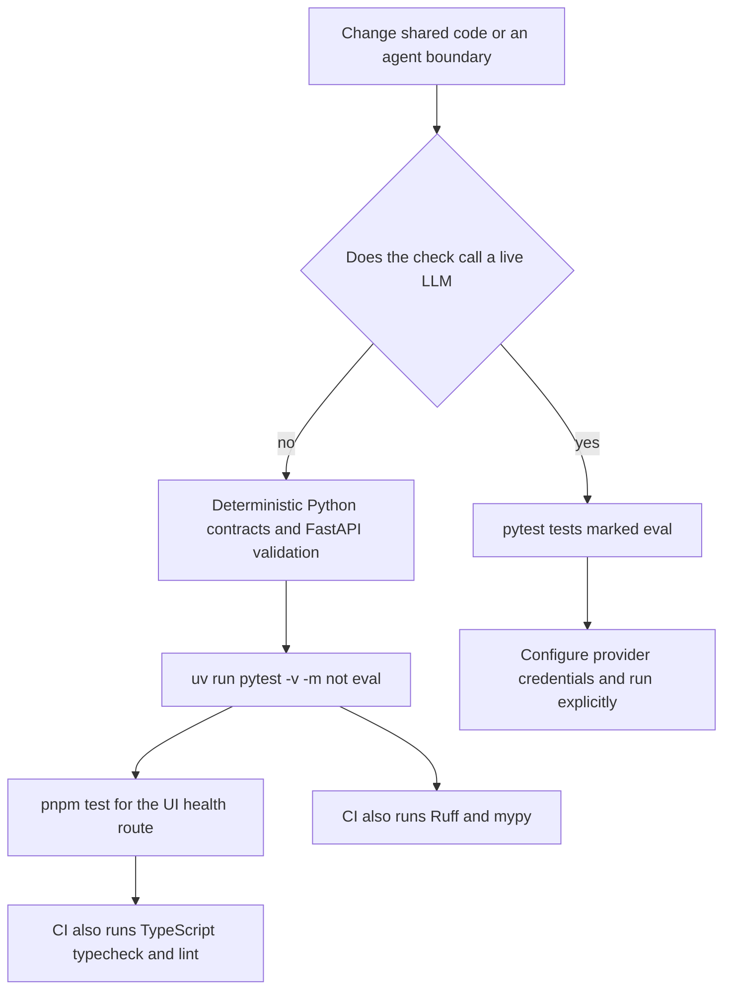
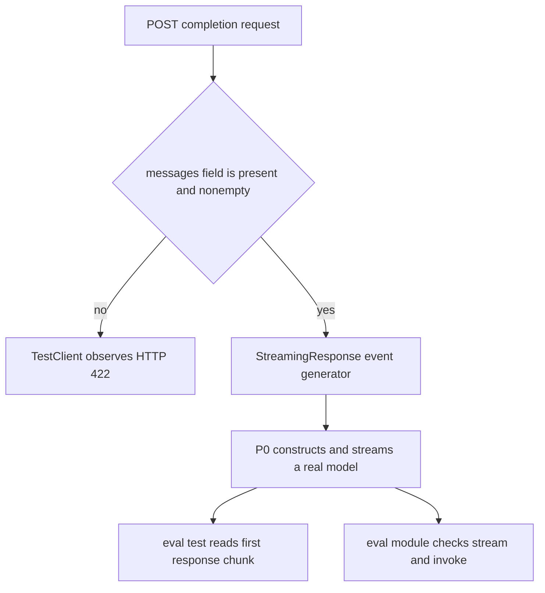

The repository deliberately does **not** treat every test as an end-to-end model test. Its routine safety net is deterministic: Python tests check shared configuration, model *construction* and routing, tracing cleanup, SSE serialization, and FastAPI request validation; the TypeScript suite checks the Next.js health handler. Provider-backed behavior is isolated behind pytest's `eval` marker because it needs a real LLM API call and can incur latency and cost.

This separation makes the normal command useful without API credentials, but it also defines its limit: a passing default suite establishes local contracts and validation behavior, not that OpenRouter, a live model, the streaming endpoint, the Next.js rewrite, and the browser UI work together. Treat a live evaluation or manual UI smoke check as an additional, deliberately configured release-confidence activity.



*The selection boundary is whether exercising the test reaches a live LLM; ordinary repository verification takes only the deterministic branch.*

## Test taxonomy and ownership

| Layer | What it proves | What it intentionally does not prove |
| --- | --- | --- |
| `common/tests` | The reusable Python contracts for configuration, model-client selection, trace scoping, and the backend SSE wire format. | Provider availability or generated-model quality. |
| `agents/P0-smoke/tests/test_server.py` | FastAPI/Pydantic rejects malformed completion requests before a stream begins. | A successful model response, except in its `eval`-marked stream test. |
| `agents/P0-smoke/tests/test_agent.py` | The expected behavior of the P0 model agent when run with a provider. The module is wholly `eval`-marked. | Any default, credential-free agent behavior. |
| `apps/chat-ui/tests` | The Next.js application's health route returns its fixed health response. | The browser chat flow, rewrite, SSE parser/reducer, rendering, cancellation, and agent availability. |
| GitHub Actions CI | Code style, static types, deterministic Python tests, and TypeScript checks in separate jobs. | Live-LLM behavior; the workflow always excludes `eval`. |

The root pytest configuration discovers `common/tests` and `agents/*/tests`, enables strict marker validation, and declares two markers: `integration` for tests requiring Docker PostgreSQL/Qdrant and `eval` for tests that call LLM APIs. The standard selector is only `-m "not eval"`; it does **not** exclude `integration`. If an integration test is added or selected, the caller must arrange its service dependencies—neither the selector nor the current CI workflow does that automatically.

## Default entrypoints

From the repository root, the normal cross-language command is:

```bash
bash scripts/test.sh
```

The script fails fast, changes to the repository root, runs the Python selector below, and then runs `pnpm test` inside `apps/chat-ui` when that directory exists:

```bash
uv run pytest -v -m "not eval"
(cd apps/chat-ui && pnpm test)
```

Use the Python portion by itself when iterating on shared Python code:

```bash
uv run pytest -v -m "not eval"
```

This command is a selection policy, not a mock framework. It runs all discovered unmarked tests and deselects any test carrying `eval`, including tests marked at module scope. Because `--strict-markers` is enabled, a misspelled or undeclared marker fails collection rather than silently creating an unintended category.

For provider-backed P0 behavior, run a deliberately configured suite rather than removing the marker just to make the default command pass:

```bash
cd agents/P0-smoke
uv run pytest -v
```

The P0 `reasoning` route needs `OPENROUTER_API_KEY`; a real call may also exercise the configured LangSmith environment. Keep keys in local environment configuration, expect latency/cost, and use this as an explicit evaluation step. The `eval` label means “calls an LLM API,” not a claim that the test is a scored quality evaluation.

## Deterministic shared-contract tests

The `common` suite is the most important regression boundary because P0 and future agents consume these helpers. These tests use real local objects and environment manipulation rather than provider/network mocks: they never invoke a model. `monkeypatch` is used to supply or remove environment values, and `get_settings.cache_clear()` is used where a fresh cached settings object is required. This is necessary because `get_settings()` is an `lru_cache(maxsize=1)` process configuration accessor.

### Configuration and trace lifecycle

`test_config.py` verifies settings defaults, environment overrides, composition of `<prefix>/<slug>` project names, and that repeated `get_settings()` calls return the same cached instance. The behavioral boundary is configuration state: an environment change is not observed by a consumer of the cached accessor until its cache is cleared.

`test_tracing.py` checks the complementary lifecycle of `setup(slug)`: the context manager sets the prefixed `LANGSMITH_PROJECT` and tracing environment while active, honors a custom project prefix, and restores a prior project value—or removes an absent one—on exit. These tests protect against process-environment leakage between agent operations; they do not make a LangSmith request.

### Model routing is configuration testing, not inference testing

`test_llm.py` asserts every known task's model ID, the fallback of an unknown task to `reasoning`, and the observable properties of the `ChatOpenAI` client constructed for OpenRouter and Ollama Cloud. It supplies placeholder credentials through the environment solely so the factory can construct a client, then inspects its model name, endpoint, and key configuration. No `.invoke()`, `.ainvoke()`, or `.astream()` is performed.

The suite also verifies the early failure boundary: missing `OPENROUTER_API_KEY` raises for non-local routes, while missing `OLLAMA_CLOUD_API_KEY` raises for the `local` route. This is a valuable mock-free check of route policy and actionable configuration errors. It cannot detect revoked credentials, remote API changes, quotas, or model output behavior; those belong to live evaluation.

### SSE protocol is asserted at byte and payload level

`test_ui_bridge.py` protects the shared backend-to-UI protocol without starting either server. It asserts exact compact SSE framing, rejects an unknown event type, fixes the complete closed vocabulary, and parses the JSON payload produced by each event helper. The asserted names are `token`, `tool_start`, `tool_end`, `message_end`, `error`, and `trace_meta`.

This is the principal compatibility test for a backend that changes streaming events. A new event name or payload field is not safe merely because Python can emit it: the TypeScript `StreamEvent` union and runtime event-name guard must be updated in coordination. Conversely, passing these serializer tests alone does not establish that the UI parser or reducer correctly handles a new protocol feature.

## P0 tests: validation before streaming versus live generation

The FastAPI server tests use `TestClient(app)`. Two unmarked tests send an empty `messages` list or omit `messages` and assert HTTP 422. They are deterministic because Pydantic validation rejects the request before `chat_completions()` starts its streaming generator, model construction, tracing scope, or provider work. Keep malformed-request tests in this layer whenever changing the completion schema.

A well-formed endpoint test is explicitly marked `eval`. It opens `POST /v1/chat/completions`, asserts status 200 and a `text/event-stream` content type, then reads one response chunk. That first chunk depends on the P0 agent's real OpenRouter stream, so the test rightly remains outside `pytest -m "not eval"`. It is a narrow transport-and-liveness check, not a full assertion over generated text or every terminal event.

The whole `test_agent.py` module has `pytestmark = pytest.mark.eval`. Therefore **all** four tests in that module are excluded by the default selector, including the runnable-shape and shared-event-vocabulary assertions. The async stream test requires tokens plus `message_end` and `trace_meta`; the async one-shot test calls `invoke()` and expects text with the `not-traced` placeholder run ID. `build_agent()` also constructs the configured model client. Module-level marking keeps the file operationally consistent with its provider-dependent agent subject, but it means that its apparently structural checks are not default coverage.



*P0's deterministic boundary ends at request validation; consuming a valid response crosses into live-provider behavior.*

## TypeScript health coverage and its boundary

The UI uses Vitest with the Node environment and includes `tests/**/*.test.ts`; the `@` alias resolves from the application root. Its current single repository test imports `GET` directly from `app/api/health/route`, expects HTTP 200, and expects exactly `{ status: "ok" }`.

That test is a useful application-health contract: it verifies the health handler's response without launching Next.js or contacting an agent. It is not an end-to-end health check. The route has no backend probe, and the suite has no tests for `streamChat()`'s incremental SSE parsing, HTTP-error conversion, chat state updates, `/v1/*` rewrite, tool lifecycle display, trace links, or abort handling. Changes in those areas need focused deterministic tests added at the parser/reducer or component boundary, plus an interactive smoke check against a compatible agent when warranted.

## CI gates and their scope

`.github/workflows/ci.yml` runs on pushes to `main` and `foundation`, pull requests targeting `main`, and manual dispatch. It separates Python and TypeScript jobs, so neither job substitutes for the other.

| Job | Setup | Required checks |
| --- | --- | --- |
| Python | Ubuntu with `uv`, followed by `uv sync --all-packages --all-extras` | Ruff lint for `common` and `P0-smoke` sources/tests; strict mypy for their source trees; `uv run pytest -v -m "not eval"`; Ruff formatting checks for those sources/tests. |
| TypeScript | Ubuntu in `apps/chat-ui`, Node 20, pnpm install with `--frozen-lockfile` | `pnpm typecheck`, `pnpm lint`, and `pnpm test`. |

The Python quality policy comes from root `pyproject.toml`: Ruff targets Python 3.11 with a 100-character line length and a selected lint rule set, while mypy is configured `strict = true` with the Pydantic plugin. CI checks formatting with `ruff format --check`; it does not rewrite files. The UI has Prettier configuration and a `pnpm format` script, but that script writes formatting and is **not** run by the current CI workflow. Do not describe the TypeScript job as having a format gate unless the workflow is changed.

CI intentionally excludes live `eval` tests and does not inject provider keys, making it suitable for repeatable pull-request verification but insufficient to certify provider integration. It also does not provision Docker services. Before changing a default test's service or credential assumptions, decide whether CI should provision that dependency, the test should be separately selected, or the behavior belongs in an explicit manual/evaluation procedure.

## Change-oriented verification guide

1. **Settings, routing, tracing, or SSE helper change:** run the non-eval Python suite and the targeted `common` tests; preserve cache-reset and trace-restoration cases. For SSE changes, update Python and TypeScript protocol definitions and add UI parser/reducer coverage rather than relying only on serializer tests.
2. **Completion schema or server failure change:** retain the deterministic 422 cases and add request-level tests that do not require a model. Exercise a valid stream only as `eval` with credentials, since a started SSE response cannot be validated without crossing the provider boundary.
3. **P0 prompt/model-stream change:** run the explicit `eval` suite with a controlled provider account. Review output behavior separately from transport assertions; the present tests only require type/event-level outcomes.
4. **UI health-route change:** run `cd apps/chat-ui && pnpm test`. **UI streaming change:** add tests beyond the existing health test, then run `pnpm typecheck`, `pnpm lint`, and `pnpm test`.
5. **Before a merge:** run the relevant CI-equivalent commands locally, including Python Ruff lint, mypy, and `ruff format --check` for Python changes; retain the UI lockfile for dependency changes because CI installs with `--frozen-lockfile`.

For contract details behind these checks, see [Shared Agent Contracts](/openwiki/concepts/shared-agent-contracts.md), [Chat UI and Agent API Boundary](/openwiki/integrations/chat-ui-agent-boundary.md), [P0 Smoke Agent Backend](/openwiki/systems/p0-smoke-agent.md), and [Local Development, Services, and CI](/openwiki/operations/local-development-and-ci.md).
