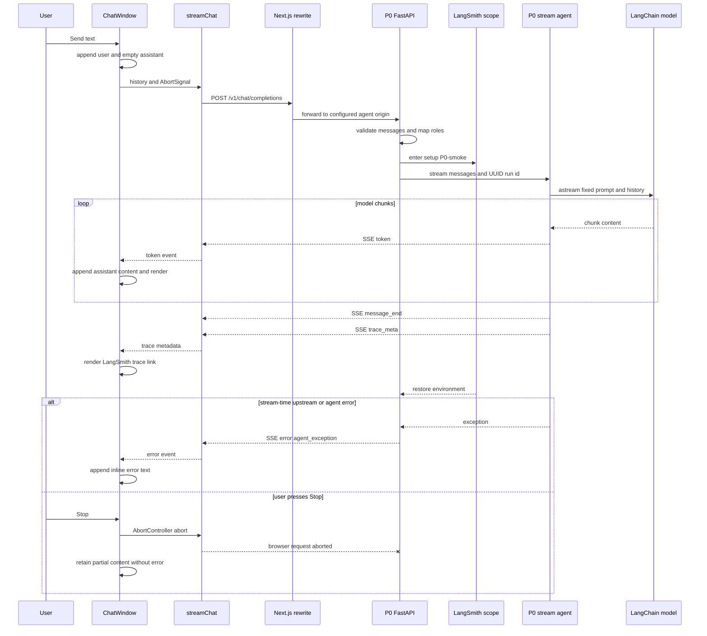

A chat turn is an in-memory, single-request stream. The browser optimistically creates the user turn and an empty assistant turn, posts the accumulated conversation to a same-origin endpoint, and replaces that assistant turn as events arrive. Next.js proxies the endpoint to the selected agent service; the P0 smoke agent is the reference implementation of that service. Neither the UI nor P0 persists a conversation or allocates a UI-visible conversation ID.

## Request and stream lifecycle



*One P0 completion from optimistic browser state through the proxy, scoped generation, normal SSE events, and the distinct in-band error and client-abort boundaries.*

### 1. Browser turn ownership

`ChatWindow` owns the displayed `messages`, draft input, `busy` flag, and the current `AbortController`. `send()` trims the input and refuses a blank submission or another submission while busy. It clears the draft, appends a user message and a blank assistant message, and sends the history ending with that user message. IDs, tool state, and trace state belong to the UI message model and are not placed in the HTTP request.

The UI permits user and assistant history in its live flow; its adapter type can also represent `system` messages. The server accepts `system`, `user`, and `assistant` transport roles and maps them, in order, to LangChain `SystemMessage`, `HumanMessage`, and `AIMessage`. Request schema validation requires at least one message, so missing or empty `messages` receives FastAPI's normal HTTP 422 response before an event stream is established.

### 2. Same-origin request and backend selection

`streamChat()` sends `POST /v1/chat/completions` with `content-type: application/json` and this body shape:

```json
{"messages":[{"role":"user","content":"Hello"}],"stream":true}
```

The browser uses the relative path, not an agent URL. The Next.js rewrite maps `/v1/:path*` to `${NEXT_PUBLIC_AGENT_BASE_URL}/v1/:path*`, defaulting to `http://localhost:8000`. This decouples browser code from the agent origin and avoids a direct cross-origin request in the UI. Changing the backend means configuring `NEXT_PUBLIC_AGENT_BASE_URL` and restarting Next.js; the replacement still needs to serve the completion endpoint and compatible stream.

The P0 `stream` request field defaults to `true`, but P0 always returns `StreamingResponse(..., media_type="text/event-stream")`; it does not expose a non-streaming response branch. A non-OK response or an OK response with no readable body is normalized by `streamChat()` into one `error` event with `code: "http_error"` and then ends iteration.

### 3. Scoped agent generation

For a valid request, P0 creates a UUID `run_id` and enters `with setup("P0-smoke"):` around model construction and stream iteration. `setup()` derives the project name from `LANGSMITH_PROJECT_PREFIX` (default `LearnAgenticAI`), temporarily sets LangSmith tracing, endpoint, optional API key, and project environment variables, then restores their previous values in `finally`.

The scope uses process environment variables, so it is not request-local isolation for differently configured concurrent requests. Keep the scope around the generation operation and do not treat the emitted trace URL as proof that LangSmith recorded a trace. P0 constructs the URL as `https://smith.langchain.com/r/<run_id>` from its locally generated UUID.

Inside the scope, `stream_agent()` constructs the `reasoning` model with `get_model("P0-smoke", task="reasoning")`, prepends P0's fixed friendly-echo system prompt, and calls `astream()` with that prompt followed by the translated request history. The configured reasoning route requires `OPENROUTER_API_KEY` and uses the shared OpenRouter-compatible model configuration. A missing credential, tracing problem, or provider failure can therefore occur after FastAPI has selected a streaming response.

## SSE protocol and client reduction

The shared serializer emits one UTF-8 event using this framing:

```text
event: <event_type>
data: <compact JSON object>

```

Only six event names are part of the contract. The client records an `event: ` name, parses the following single `data: ` line as JSON, and yields it only if the name is in its matching runtime allowlist. It buffers incomplete lines across read chunks, but deliberately skips malformed JSON and unknown names; it does not validate payload fields at runtime. Backends must therefore preserve the name, one-line framing, and field shapes rather than relying on multiline SSE data or protocol extensions.

| Event | Payload | Client state effect |
| --- | --- | --- |
| `token` | `{ "content": string }` | Append content to the accumulated assistant message. |
| `tool_start` | `{ "tool_name": string, "args": object, "call_id": string }` | Add or replace a tool call keyed by `call_id`. |
| `tool_end` | `{ "call_id": string, "result": any }` | Attach a result only when the matching start is already known. |
| `message_end` | `{ "finish_reason": string }` | Protocol-level normal completion; the current reducer makes no visible state change. |
| `error` | `{ "message": string, "code": string }` | Append `[error: <message>]` to the assistant content. |
| `trace_meta` | `{ "run_url": string, "run_id": string }` | Attach trace metadata to the assistant message. |

P0 normally emits zero or more `token` events, then `message_end` with `finish_reason: "stop"`, then `trace_meta`. It does not emit tool lifecycle events. A tool-capable backend must send `tool_start` before its correlated `tool_end`, because an unmatched end is ignored by the reducer; use a stable, unique `call_id` per assistant turn.

For every recognized event, `ChatWindow` updates its mutable accumulated assistant message, copies the tool-call map into that message, and replaces the last entry in React state. That replacement causes incremental rendering and scroll-to-bottom. `MessageBubble` renders the accumulated text and any tool records; when `trace_meta` is received, it renders `TraceLink`, which opens the supplied URL in a new tab with `noopener noreferrer` and displays a shortened run ID.

## Failure and cancellation semantics

There are three externally different failure paths:

1. **Request validation failure.** Empty or absent `messages` is rejected as HTTP 422 before the P0 generator begins. Other non-success HTTP responses are converted by the client adapter to its one `http_error` event.
2. **Failure after streaming begins.** P0 wraps its tracing scope and `stream_agent()` iteration in a broad exception handler. It yields the shared `error_event(str(e), code="agent_exception")`; it cannot replace an established SSE response with a conventional HTTP error. The UI renders that event inline and continues to its normal iterator completion. If the exception interrupts normal generation, P0 does not add compensating `message_end` or `trace_meta` events.
3. **User cancellation.** While busy, **Stop** calls `abort()` on the request's `AbortController`. If iteration throws and that controller is aborted, `ChatWindow` returns silently: already rendered tokens and tool state remain, and no abort error is appended. Other thrown transport or parser errors are appended as inline error text.

The `finally` path always clears `busy` and the controller, including normal completion, an in-band stream error, a non-abort exception, and a client abort. The next turn can then be submitted, but it only includes the client-side message history; P0 itself maintains no stored conversation state or explicit disconnect policy.

## Safe extension points

A future agent can replace P0 without adopting FastAPI, LangChain, or LangSmith, but it must retain the observable boundary: accept a nonempty ordered message list at `POST /v1/chat/completions`, return `text/event-stream`, and emit the supported names and payloads. `common.ui_bridge` is the reference serializer for Python services. Adding an event is a coordinated protocol change: update the Python allowlist/builders, TypeScript `StreamEvent` union and runtime guard, parser/reducer, presentation, and tests together.

P0-specific behavior is separately replaceable: the fixed system prompt, the `reasoning` task selection and token budget, and the model stream implementation. Preserve the post-stream error event boundary even if a replacement has richer tool loops or trace instrumentation. Do not expose sensitive material in `tool_start.args`, `tool_end.result`, error text, or trace metadata: the current UI renders those values directly to the chat user.

## Configuration and focused verification

For the local reference pair, set `OPENROUTER_API_KEY` in the root `.env`, start P0 on port 8000, then run the UI in a separate terminal:

```bash
cd agents/P0-smoke
uv run uvicorn P0_smoke.server:app --reload --port 8000
```

```bash
cd apps/chat-ui
pnpm install
pnpm dev
```

`apps/chat-ui/.env.local` may set `NEXT_PUBLIC_AGENT_BASE_URL=http://localhost:8000`; this is also the rewrite fallback. LangSmith configuration is optional for startup, while the reasoning model route requires its OpenRouter credential.

The strongest offline contract coverage is `common/tests/test_ui_bridge.py`, which asserts exact SSE framing, rejects unknown event types, and checks all helper payloads. `common/tests/test_tracing.py` checks project selection and restoration. P0 server tests deterministically cover the 422 validation boundary; successful endpoint and model-stream tests are marked `eval` because they need a live provider. The current UI Vitest suite only tests `GET /api/health`, not stream parsing, reduction, or cancellation. For stream changes, add deterministic fragmented-chunk, error-event, tool-ordering, trace-rendering, and abort tests in addition to running:

```bash
uv run pytest -v -m "not eval"
cd apps/chat-ui && pnpm typecheck && pnpm test
```

See [Shared Agent Contracts](/openwiki/concepts/shared-agent-contracts.md) for cross-agent serializer, tracing, and model-routing rules; [Chat UI and Agent API Boundary](/openwiki/integrations/chat-ui-agent-boundary.md) for the reusable UI contract; [P0 Smoke Agent Backend](/openwiki/systems/p0-smoke-agent.md) for the reference backend; and [Local Development, Services, and CI](/openwiki/operations/local-development-and-ci.md) for operational setup.
